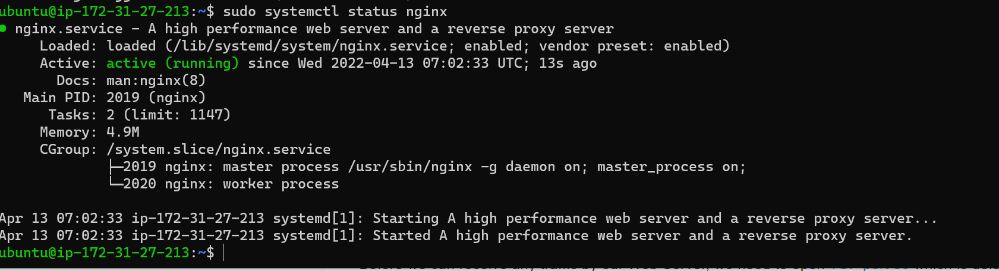
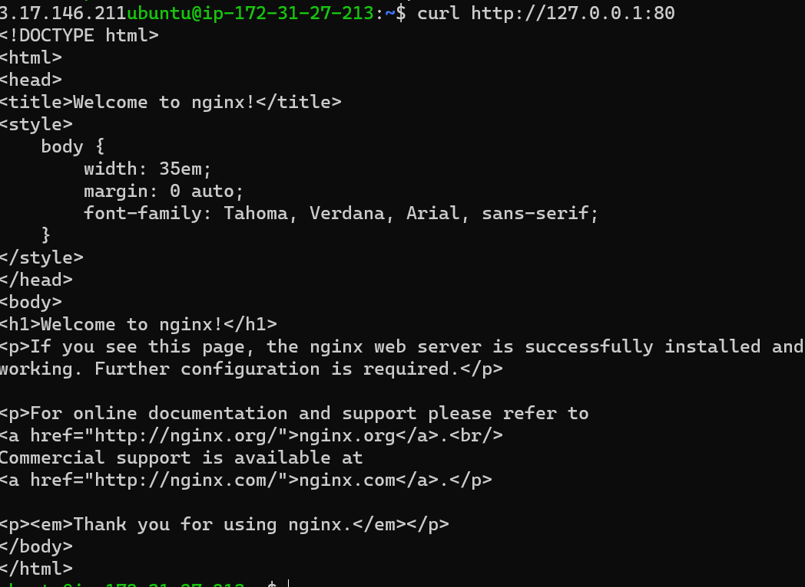
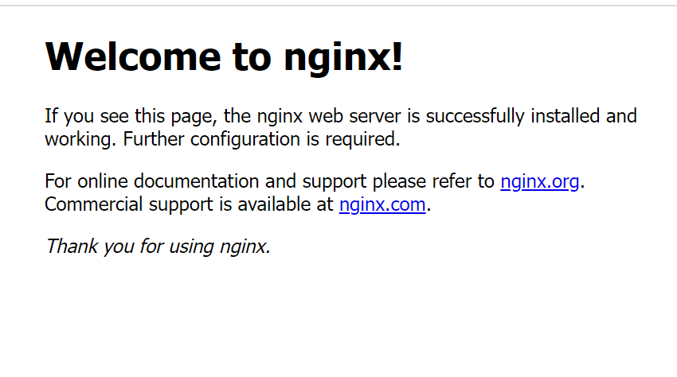

## LEMP PROJECT

`sudo apt update` 

`sudo apt install nginx` 

`sudo systemctl status nginx` 

`curl http://127.0.0.1:80` 

`http://<Public-IP-Address>:80` 

`curl -s http://169.254.169.254/latest/meta-data/public-ipv4` 

`code` 
